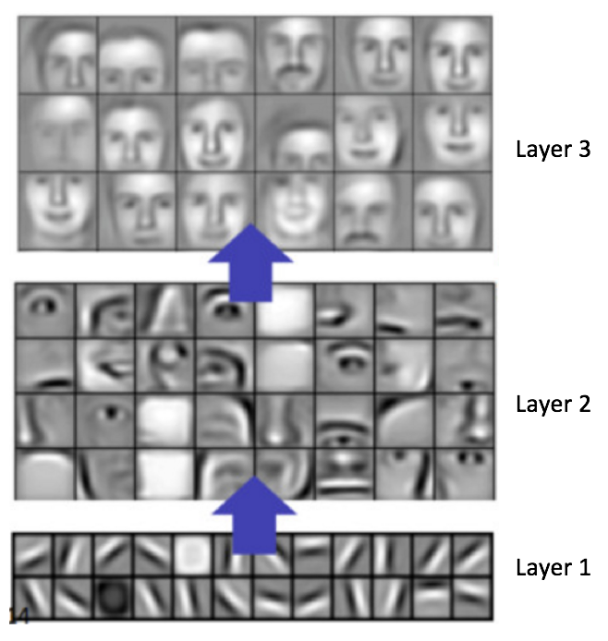
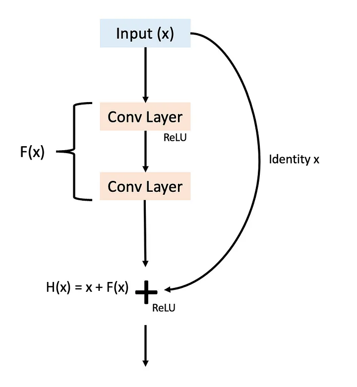
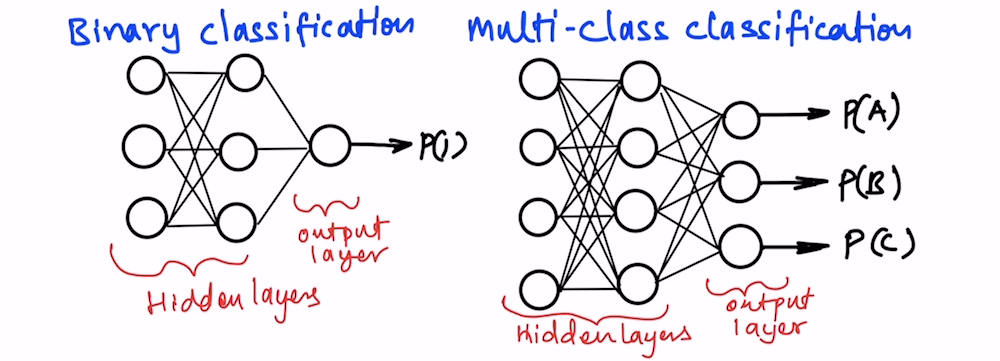
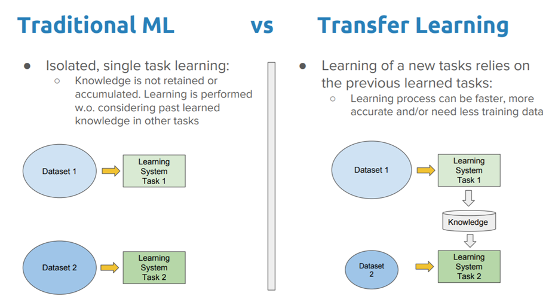
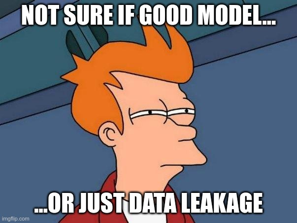

# Introduction to Siamese Network

## Typical image classificator

### Convolutional layers
\
Source: https://www.kdnuggets.com/2016/11/intuitive-explanation-convolutional-neural-networks.html/3

The first convolution layers can recognize simple patterns. The next ones are able to identify more complex shapes. In reality, CNN filters are usually not understandable to humans.\
Interesting fact: apparently the human brain recognizes shapes in a similar way.

Many modern computer vision networks use residual connections:


[Polo Club](https://github.com/poloclub) of Data Science at Georgia Tech has implemented an amazing [CNN visualization tool](https://poloclub.github.io/cnn-explainer/#article-convolution).

### Simple image classificator architecture
\
Source: https://medium.com/@mayankverma05032001/binary-classification-using-convolution-neural-network-cnn-model-6e35cdf5bdbb

### Binary vs multi-class classification
\
Source: https://thinkingneuron.com/how-to-use-artificial-neural-networks-for-classification-in-python/

<center><ins>Question</ins></center>
How to add another class to the above model?

<details>
  <summary>Answer</summary>

  One neuron should be added to the last layer. Then re-train the entire network, its last layers, or only one added neuron.
  
</details>

### Limitations of such an approach:
- works only on objects from trained classes
- adding next class needs next training, time and hardware resources, qualified specialist

**Siamese Network solves these limitations.**

***

## Embedding (encoding)
Embedding is a multidimensional vector representation of an object (image, movie, article, word, phrase etc.).
You can imagine that this process means ***placing*** an object in a ***multidimensional space***.

\
Source: https://medium.com/mlearning-ai/intuition-to-neural-network-embeddings-986c6bcaa502

Specify embeddings associated with the movies:
- Star Wars
- Memento
- Hero
- Incredibles
<details>
  <summary>Answer</summary>
  <ul>
    <li>Star Wars: [0.1, 0.9]</li>
    <li>Memento: [0.9, -0.8]</li>
    <li>Hero: [0.3, 0.2]</li>
    <li>Incredibles: [-0.6, 0.6]</li>
  </ul>
  
</details>

Note that these vectors store some knowledge about the given objects (movies). This is a very simple case, but multidimensional embeddings can transform an object into complex information about it.

***

## Siamese network architecture

In the "Siamese Network" architecture, we don't rely on a fixed number of neurons where each evaluates the likelihood of a photo belonging to a specific class. Instead, we transform each photo into its 'embedding' and then compare these embeddings with each other. If they are sufficiently similar, we consider that they belong to the same class:

\
Source: https://datahacker.rs/019-siamese-network-in-pytorch-with-application-to-face-similarity/

How does it work? The Siamese Network uses two matching networks to turn a photo into its embedding. These twin networks are identical – they have the same number of layers, types of layers, and even the same weights. Once we obtain the 'embeddings' of the photos, we must use additional components that compare them to each other. If they're close enough, we say the photos are from the same class.

\
Source: https://towardsdatascience.com/what-are-siamese-neural-networks-in-deep-learning-bb092f749dcb

When training a Siamese Network, it's crucial to update the weights of both base networks simultaneously to keep them identical. This ensures the networks can effectively compare photos, learning to recognize which ones are similar and which are not. The training process focuses on adjusting the weights so that 'embeddings' of similar photos come closer together, while those of different photos move apart.

Example code inspired by [this implementation](https://keras.io/examples/vision/siamese_network/)

```python
embedding = Model(base_cnn.input, output, name="Embedding")

input1 = layers.Input(shape=target_shape)
input2 = layers.Input(shape=target_shape)

distances = DistanceLayer()(
    embedding(input1),
    embedding(input2)
)

siamese_network = Model(
    inputs=[input1, input2], outputs=distances
)
```

Note that the <ins>**base model is initialized only once**</ins>, and then we save it to the variable "embedding".

***

## Contrastive loss


For the same class:
```math
loss = distance(img1, img2)^2
```
For different classes:
```math
loss = 
\begin{cases} 
(margin-distance(img1, img2))^2 & \text{if } margin > distance(img1, img2) \\
0 & \text{otherwise}
\end{cases}
```

Notice that when comparing images of **the same class**, the **loss function decreases** as the **distance** between their embeddings gets **smaller**. This encourages the model to learn representations where similar items are closer together in the embedding space.

On the other hand, for images from **different classes**, the **loss function decreases** as the **distance** between their embeddings **increases**. The goal here is to push apart the representations of dissimilar items. If the distance between embeddings of different classes exceeds a certain 'margin' threshold, the loss function then takes a value of 0. This mechanism ensures that, beyond a point, the model is not penalized further for distances that are already sufficiently large, focusing the learning on more challenging or closer pairs.

How do we measure the distance between two embeddings? Typically, we use the Euclidean distance:
```math
distance(\mathbf{a}, \mathbf{b}) = \sqrt{\sum_{i=1}^{n} (a_i - b_i)^2} = \sqrt{(a_1 - b_1)^2 + (a_2 - b_2)^2 + \cdots + (a_n - b_n)^2}
```

L2 normalization of vectors can simplify calculations and project development. If points are located on a sphere of length 1, it limits the maximum distance between them and facilitates the appropriate selection of "margin" values.

What is the maximum distance, and what is the maximum value of the loss function for two vectors after L2 normalization?

<details>
  <summary>Answer</summary>

  Distance: 2<br/>
  Loss function for the same class: 4<br/>
  Loss function for different classes: margin^2

</details>

***

## Triplet loss

The 'triplet loss' function is designed for training models to differentiate between similar and dissimilar instances in a dataset. It involves three key elements: an 'anchor' (a reference item), a 'positive' (another item of the same class as the anchor), and a 'negative' (an item from a different class).


Source: https://omoindrot.github.io/triplet-loss

The goal of triplet loss is to make the anchor closer to the positive than to the negative in the model's learned space. This is achieved by minimizing the distance between the anchor and the positive while maximizing the distance between the anchor and the negative, thus helping the model learn to distinguish even subtle differences between classes.


Source: https://towardsdatascience.com/triplet-loss-advanced-intro-49a07b7d8905

Formula:

Source: https://en.wikipedia.org/wiki/Triplet_loss

***

## Transfer learning

Transfer learning is a technique in machine learning where knowledge gained while solving one problem is applied to a different but related problem. For example, a model trained to recognize objects in pictures can be used as a starting point for recognizing specific animals. With transfer learning, we don't have to start training a model from scratch but can "transfer" already learned patterns and adapt the model to a new task, which often saves time and computational resources.

\
Source: https://www.analyticsvidhya.com/blog/2021/10/understanding-transfer-learning-for-deep-learning/

\
Source: https://towardsdatascience.com/a-comprehensive-hands-on-guide-to-transfer-learning-with-real-world-applications-in-deep-learning-212bf3b2f27a

<p float="left">
  
  
  
</p>

Sources: [1](https://www.reddit.com/r/TheInsaneApp/comments/q2e2ru/transfer_learning/), [2](https://medium.com/analytics-vidhya/transfer-learning-in-nutshell-f49cf3ab5f7f), [3](https://medium.com/aimonks/a-gentle-introduction-to-transfer-learning-77fcc55f180d)

[List](https://keras.io/api/applications/) of computer vision models to use in keras. Note the results and the number of parameters. A model designed for one purpose (classification) does not necessarily work well for another (embedding).

When training models using 'transfer learning,' we need to keep a few things in mind. This is beyond the scope of this lecture, but it is covered very well in this article: https://blog.keras.io/building-powerful-image-classification-models-using-very-little-data.html

***

## Create embedding from typical image classificator
\
Source: https://medium.com/mlearning-ai/intuition-to-neural-network-embeddings-986c6bcaa502

Each neuron in this layer outputs a single number, resulting in the layer generating a vector whose dimensionality matches the number of neurons.

***

## Overfitting and underfitting


| Underfitting                      | Overfitting                                                                                    |
|-----------------------------------|------------------------------------------------------------------------------------------------|
| High error on train set           | Low error on train set                                                                         |
| High error on test set            | High error on test set                                                                         |
| Too simple to understand the data | Focused on specific examples from train set,<br/>doesn't understand real structure of the data | 

***Overfitting*** occurs when a machine learning model is complex enough to perform excellently on the training dataset but becomes overly fitted to it, resulting in much poorer outcomes on the test dataset. It fails to generalize its knowledge to new, unseen data because it focuses on specifics that lack broad applicability. 

Analogy to real life: student who memorizes specific questions and answers from a test instead of understanding the overarching principles. When faced with new questions, the student is unable to respond because they have not learned to understand the material, only memorized specific instances.

***Underfitting*** happens when a model is too simplistic to understand the structure of the data. It cannot learn even the patterns present in the training data, leading to poor performance on both training and test datasets.

Analogy to real life: student attempting to understand complex material with very limited knowledge, insufficient materials, or time, and being unable to understand even the basic principles.

<p float="left">
  
  
</p>

Source: https://twitter.com/MaartenvSmeden/status/1522230905468862464

<p float="left">
  
  
</p>

Source: [1](https://twitter.com/MaartenvSmeden/status/1522230905468862464), [2](https://www.reddit.com/r/machinelearningmemes/comments/f2m7yc/another_overfitting_meme/)

<p float="left">
  
</p>

Source: https://www.youtube.com/watch?app=desktop&v=p-bGd_TD170

<center><ins>Questions</ins></center>

\
Source: https://www.fastaireference.com/overfitting

Which classification represents a good model, underfitting and overfitting?

<details>
  <summary>Answer</summary>

  First - underfitting
  Second - good model
  Third - overfitting

</details>

\
Source: https://machine-learning.paperspace.com/wiki/overfitting-vs-underfitting

Which regression represents a good model, underfitting and overfitting?

<details>
  <summary>Answer</summary>

  First - overfitting
  Second - good model
  Third - underfitting

</details>

#### Train dataset
Lions
<p float="left">
  
   
  
</p>

Polar bears
<p float="left">
  
   
  
</p>

#### Test sample


Will the model correctly classify the above example?

<details>
  <summary>Answer</summary>

  It is very possible that the model will look at the background instead of paying attention to the animal itself. All the pictures of polar bears from the trainer's collection have a white background, and all the lions have a green background.
  The test example has a white background, so it may be incorrectly classified as a polar bear.
  
</details>

\
Source: https://medium.com/@datascienceeurope/do-you-know-overfitting-and-underfitting-f27f87ac2f37

Which learning curve represents a good model, underfitting and overfitting?

<details>
  <summary>Answer</summary>

  First - underfitting
  Second - good model
  Third - overfitting

</details>

***

## Data leakage

\
Source: DALL-E

Data leakage refers to a situation where information from outside the training dataset is used in an undesirable manner to create the model, leading to overly optimistic performance estimates. This happens when the model learns from data it shouldn't have access to during training, resulting in excellent performance on training data but poor performance on new or real-world data. It undermines the model's ability to generalize and can occur in various forms, such as improper separation of training and validation datasets (validation leakage).

\
Source: own

Analogy to real life: the student received exam questions from older colleagues. Although he got a good grade, his actual knowledge is at a low level.

<center><ins>Questions</ins></center>

1. We aim to develop a regression model for precise housing price prediction. Our dataset comprises 20,000 sales transactions of various apartments. We randomly partition this dataset into training and test sets at an 80-20 ratio. Is there any data leakage present?

<details>
  <summary>Answer</summary>

  No, all the examples are independent and none of the unwanted information from the train dataset will leak into the test dataset.

</details>

2. We aim to develop a classification model to determine the presence of cancer in individuals. Our dataset consists of labeled lung X-ray images from various individuals, indicating both healthy subjects and those diagnosed with lung cancer. Notably, multiple images were taken for some individuals. We randomly split this data into training and test sets using a 90-10 ratio. Could there be data leakage in this scenario?

<details>
  <summary>Answer</summary>

  Yes. Lung x-rays of the same person can go to both collections. This can cause the model to somehow remember that the person is sick, instead of learning the general rules for recognizing cancer.

</details>

3. We aim to develop a model to forecast future Bitcoin prices, utilizing daily historical Bitcoin price records. We organize this data into weekly intervals, spanning Monday through Sunday, and subsequently divide these weeks randomly in a 75-25 ratio. Is there a possibility of data leakage in this approach?

<details>
  <summary>Answer</summary>

  Yes. If the training dataset includes weeks that directly precede and follow a week from the test dataset, it simplifies the process of identifying trends. However, in real-world scenarios, we lack the opportunity to verify the prices for the week following to the one we are forecasting against.

</details>

4. We want to implement a model that, when diagnosing a patient, will help assess whether they have cancer. Each patient has one record in the database with:
   1. various parameters of blood
   2. information whether the patient died after six months
   3. weight
   4. height

   Is there any data leakage present?
<details>
  <summary>Answer</summary>

  Yes. In a real-life scenario, during a patient visit, we can't obtain information about whether the patient will die in six months.
</details>

## Various applications of Siamese Network architecture

<center><b>Phone face verification</b></center>

<center><ins>Question</ins></center>
We have trained the model in the Siamese Network architecture so that it would compare facial images with each other. We are implementing a phone login system. At the very beginning, the user is supposed to take a picture of their face. The phone is then supposed to take a picture of the user every time they try to unlock and assess whether they own the phone. How do we implement this?

<details>
  <summary>Answer</summary>

  For each authorization, we have embeddings of two photos - one taken initially on the phone and the other of the user trying to use the phone. By comparing these two embeddings, we get a similarity score. We need to set a threshold, below which we consider that the person trying to use the phone is indeed its owner.
  
</details>

<center><b>Gym customers face recognition</b></center>
<center><ins>Question</ins></center>
The gym has 20 clients who frequently lost their badges, asking the owner to adopt a facial recognition system to verify individuals' access. How can this be implemented? We can use the base model from the previous question.

<details>
  <summary>Answer</summary>

  Do the same as for 'phone face verification', but sequentially for the photo database of all customers. If the customer is recognised, let them in depending on their active membership.
  
</details>

<center><b>Best match between actor and historical role</b></center>
<center><ins>Question</ins></center>
A maker of a historical film has a photo database of twenty actors. He wants to find one that most resembles the historical figure (of whom he also has a photo). How do you accomplish this task using the architecture of the Siamese Network? We can use the model from the previous questions.
<details>
  <summary>Answer</summary>

  We assign a 'similarity score' to each actor's photo relative to the historical figure photo. We sort the values in ascending order and select the actor with the lowest.
  
</details>

<center><b>Large actors matching service</b></center>

We are an agency with a database of 100,000 actors. We have a picture of every one of them. We provide the service of finding and hiring the actor most similar to the character from the graphic the client provides. How do you implement such a system? We can use the model from the previous questions.
<details>
  <summary>Answer</summary>

  At a high level, we need to compare embeddings similarly to the previous question, but we need to pay attention to some implementation details.

  Due to the number of photos, we cannot create an embedding from each photo every time. We should already prepare embeddings beforehand (when adding an actor to the database) and save them in a file. Additionally, we can consider a more efficient way of finding the nearest vector.

</details>